# 12. Модель данных

## ERD (Entity-Relationship Diagram)

```mermaid
erDiagram
    User {
        uuid id PK
        string email UK
        string display_name
        string avatar_url
        string timezone
        string password_hash
        string oauth_provider
        string oauth_id
        boolean is_active
        timestamp created_at
        timestamp updated_at
    }

    Group {
        uuid id PK
        string name UK
        string description
        timestamp created_at
    }

    GroupMember {
        uuid group_id FK
        uuid user_id FK
        timestamp added_at
    }

    Project {
        uuid id PK
        string name
        string key UK
        string description
        string visibility
        uuid owner_id FK
        boolean is_archived
        timestamp archived_at
        timestamp deleted_at
        integer version
        timestamp created_at
        timestamp updated_at
    }

    ProjectMember {
        uuid id PK
        uuid project_id FK
        uuid user_id FK
        uuid group_id FK
        string role
        timestamp created_at
    }

    ProjectLink {
        uuid id PK
        uuid project_a_id FK
        uuid project_b_id FK
        string link_type
        uuid created_by FK
        timestamp created_at
    }

    Workflow {
        uuid id PK
        uuid project_id FK
        string name
        boolean is_default
        timestamp created_at
    }

    Status {
        uuid id PK
        uuid workflow_id FK
        string name
        string category
        string color
        integer position
        boolean is_initial
        boolean is_final
    }

    Transition {
        uuid id PK
        uuid workflow_id FK
        uuid from_status_id FK
        uuid to_status_id FK
        string[] allowed_roles
    }

    Resolution {
        uuid id PK
        uuid project_id FK
        string name
        boolean is_active
        integer position
    }

    Task {
        uuid id PK
        string key UK
        uuid project_id FK
        uuid workflow_id FK
        uuid reporter_id FK
        uuid decision_maker_id FK
        string title
        text description
        string task_type
        string priority
        uuid current_status_id FK
        enum global_status
        tsvector search_vector
        date due_date
        decimal estimated_hours
        boolean allow_multi_accept
        timestamp deleted_at
        integer version
        timestamp created_at
        timestamp updated_at
    }

    TaskLink {
        uuid id PK
        uuid source_task_id FK
        uuid target_task_id FK
        string link_type
        uuid created_by FK
        timestamp created_at
    }

    Label {
        uuid id PK
        uuid project_id FK
        string name
        string color
        boolean is_active
    }

    TaskLabel {
        uuid task_id FK
        uuid label_id FK
    }

    Attachment {
        uuid id PK
        uuid task_id FK
        uuid comment_id FK
        uuid uploaded_by FK
        string filename
        string storage_path
        integer file_size
        string mime_type
        timestamp created_at
    }

    Assignment {
        uuid id PK
        uuid task_id FK
        uuid user_id FK
        uuid workflow_id FK
        uuid current_status_id FK
        string assignee_role
        uuid resolution_id FK
        timestamp started_at
        timestamp completed_at
        timestamp created_at
        timestamp updated_at
    }

    DecisionCriteria {
        uuid id PK
        uuid task_id FK
        text description
        integer position
        boolean is_locked
    }

    Solution {
        uuid id PK
        uuid assignment_id FK
        text content
        string status
        text revision_comment
        timestamp submitted_at
        timestamp created_at
        timestamp updated_at
    }

    TaskDecision {
        uuid id PK
        uuid task_id FK
        uuid decision_maker_id FK
        uuid[] accepted_solution_ids
        text note
        timestamp decided_at
    }

    Comment {
        uuid id PK
        uuid task_id FK
        uuid author_id FK
        uuid parent_comment_id FK
        text content
        tsvector search_vector
        boolean is_deleted
        timestamp edited_at
        timestamp created_at
    }

    Watcher {
        uuid task_id FK
        uuid user_id FK
        timestamp subscribed_at
    }

    TaskHistory {
        uuid id PK
        uuid task_id FK
        uuid user_id FK
        string action
        string field_name
        text old_value
        text new_value
        timestamp created_at
    }

    AuditLog {
        uuid id PK
        uuid user_id FK
        string entity_type
        uuid entity_id
        string action
        jsonb payload
        timestamp created_at
    }

    Notification {
        uuid id PK
        uuid recipient_id FK
        string channel
        string event_type
        uuid entity_id
        string entity_type
        text message
        boolean is_read
        timestamp created_at
    }

    User ||--o{ ProjectMember : "состоит в"
    User ||--o{ GroupMember : "состоит в"
    User ||--o{ Assignment : "назначен"
    User ||--o{ Comment : "пишет"
    User ||--o{ Watcher : "наблюдает"
    User ||--o{ Notification : "получает"
    User ||--o{ TaskHistory : "совершает действие"
    User ||--o{ AuditLog : "совершает действие"
    User ||--o{ Task : "создаёт (reporter)"
    User ||--o{ Task : "decision-maker"

    Group ||--o{ GroupMember : "содержит"
    Group ||--o{ ProjectMember : "получает доступ"

    Project ||--o{ ProjectMember : "имеет участников"
    Project ||--o{ Task : "содержит задачи"
    Project ||--o{ Workflow : "использует"
    Project ||--o{ Resolution : "имеет"
    Project ||--o{ Label : "имеет метки"
    Project }o--o{ ProjectLink : "связан"

    Workflow ||--o{ Status : "содержит статусы"
    Workflow ||--o{ Transition : "содержит переходы"
    Status ||--o{ Transition : "from"
    Status ||--o{ Transition : "to"

    Task ||--o{ Assignment : "имеет назначения"
    Task ||--o{ DecisionCriteria : "имеет критерии"
    Task ||--o| TaskDecision : "имеет итоговое решение"
    Task ||--o{ Comment : "имеет комментарии"
    Task ||--o{ Watcher : "имеет наблюдателей"
    Task ||--o{ TaskHistory : "имеет историю"
    Task ||--o{ TaskLabel : "помечена метками"
    Task ||--o{ Attachment : "имеет вложения"
    Task }o--o{ TaskLink : "связана с"
    Task ||--o{ Notification : "порождает"

    Label ||--o{ TaskLabel : "применяется"
    Assignment ||--o| Solution : "подаёт"
    Comment ||--o{ Attachment : "имеет вложения"
    Comment ||--o{ Comment : "ответы"
```

---

## Комментарии к нетривиальным решениям

### Поле global_status в Task

`Task.global_status` — денормализованное поле типа `enum`. Допустимые значения: `open | in_progress | awaiting_decision | in_revision | decided | closed`. Поле `NOT NULL DEFAULT 'open'`.

Поле не вычисляется на лету — оно хранится в БД и обновляется бизнес-логикой бэкенда при каждом изменении состояния Assignment'ов и Solution'ов. Обновление происходит в той же транзакции, что и само изменение (см. раздел «Оптимистичные блокировки»).

### Полнотекстовый поиск (search_vector)

- `Task.search_vector tsvector` — объединение полей `title || description`, обновляется триггером при изменении задачи. Конфигурация: `russian` (snowball stemmer).
- `Comment.search_vector tsvector` — поле `body` (`content`), обновляется триггером. Конфигурация: `russian`.
- Индекс: `GIN(search_vector)` на обеих таблицах.

Без явного указания конфигурации `russian` стемминг для русскоязычного контента не работает.

### Политика для User: деактивация вместо удаления

Физическое удаление пользователей не поддерживается. При необходимости блокировки учётной записи — деактивация через `is_active = false`.

Последствия деактивации:
- Деактивированный пользователь не может войти в систему.
- Его отображаемое имя заменяется на «[Деактивирован]» везде, где он упоминается (задачи, комментарии, уведомления).
- Assignment'ы остаются в истории задач без изменений.
- FK-ссылки (`reporter_id`, `decision_maker_id`, `author_id` и т.д.) остаются валидными — нет битых ссылок.

### Поведение при изменении воркфлоу

Если менеджер редактирует воркфлоу (удаляет статус или закрывает переход), и в этом статусе находятся активные Assignment'ы:

1. Все Assignment'ы в удалённом/недоступном статусе откатываются к дефолтному статусу воркфлоу (начальному статусу с `is_initial = true`).
2. Система генерирует уведомление «Статус задачи изменён из-за обновления воркфлоу» для всех участников затронутых задач.
3. Событие логируется в `AuditLog`.

Если удаление статуса не затрагивает активных Assignment'ов — изменение применяется без откатов.

### Хранение personal_status каждого Assignment

Каждый `Assignment` хранит своё состояние в воркфлоу через поле `current_status_id`, ссылающееся на `Status`. У каждого Assignment может быть свой `workflow_id` (воркфлоу, по которому движется этот исполнитель — может отличаться от воркфлоу задачи, если для разных типов исполнителей используются разные воркфлоу).

Ключевой принцип: `Task.current_status_id` — **глобальный** статус задачи (open / in_progress / awaiting_decision и т.д.), а `Assignment.current_status_id` — **персональный** статус конкретного исполнителя в его воркфлоу (To Do / In Progress / Done и т.д.). Это два разных измерения.

### Связь Solution → TaskDecision

`TaskDecision.accepted_solution_ids[]` — массив UUID, хранящий ссылки на принятые Solution'ы. Это денормализованное поле (не отдельная join-таблица), обоснование:

- Decision — иммутабельная запись (после вынесения не меняется).
- Количество принятых Solution'ов невелико (обычно 1, редко 2–3).
- Запрос «какой Solution принят?» тривиален: `SELECT * FROM solution WHERE id = ANY(task_decision.accepted_solution_ids)`.

Если потребуется полноценная M:N таблица — выносится в v2 без миграции данных (массив остаётся).

### Soft-delete поля

Soft-delete реализован через `deleted_at timestamp` у сущностей `Task` и `Project`:

- `deleted_at IS NULL` — активная запись.
- `deleted_at IS NOT NULL` — мягко удалённая; не возвращается в API-запросах (кроме admin-запросов).
- Физическое удаление — только администратором вручную через специальный admin-эндпоинт.
- `Comment` и `Attachment` не имеют soft-delete: у комментария есть флаг `is_deleted` (тело заменяется на «Комментарий удалён», запись остаётся для сохранения треда).

### Оптимистичные блокировки

`Task.version` (integer) инкрементируется при каждом обновлении задачи. При редактировании клиент передаёт текущую версию; если в БД версия выше — возвращается 409 Conflict. Это предотвращает потерю изменений при одновременном редактировании задачи несколькими исполнителями.

### Уведомления

`Notification` хранит канал (`in_app` / `email`) и статус прочтения. Email-уведомления реализуются через асинхронную очередь (фоновый воркер); запись в таблице создаётся при постановке в очередь. Email-канал используется только для событий Decision Process (из `10-nfr.md`).

### ProjectMember: user_id или group_id

`ProjectMember` имеет два опциональных поля: `user_id` и `group_id`. Ровно одно из них заполнено:
- `user_id IS NOT NULL, group_id IS NULL` — прямое добавление пользователя.
- `group_id IS NOT NULL, user_id IS NULL` — добавление группы.

При разрешении прав — выполняется объединение: берётся наивысшая роль из всех записей пользователя (прямая + через группы).

---

## Схема воркфлоу

### Таблицы

**Workflow** — воркфлоу привязан к проекту. Один проект может иметь несколько воркфлоу (например, для разных типов задач). Один воркфлоу помечен как `is_default = true`.

| Поле | Тип | Описание |
|------|-----|----------|
| id | uuid | PK |
| project_id | uuid FK | Проект |
| name | string | Название (например, «Разработка», «Баг-трекинг») |
| is_default | boolean | Используется по умолчанию для новых задач |
| created_at | timestamp | |

**Status** — статус в рамках конкретного воркфлоу.

| Поле | Тип | Описание |
|------|-----|----------|
| id | uuid | PK |
| workflow_id | uuid FK | Воркфлоу |
| name | string | Название (например, «В работе», «Готово») |
| category | enum | `open` / `in_progress` / `done` — семантическая категория |
| color | string | Hex-цвет для UI |
| position | integer | Порядок отображения |
| is_initial | boolean | Начальный статус (задача попадает в него при создании) |
| is_final | boolean | Финальный статус (переход в него = завершение работы исполнителя) |

**Transition** — допустимый переход между статусами.

| Поле | Тип | Описание |
|------|-----|----------|
| id | uuid | PK |
| workflow_id | uuid FK | Воркфлоу |
| from_status_id | uuid FK | Исходный статус |
| to_status_id | uuid FK | Целевой статус |
| allowed_roles | string[] | Роли ProjectRole, которым разрешён переход. Пустой массив = разрешено всем |

### Правила переходов

1. Пользователь может совершить переход, если:
   - Существует `Transition` с `from_status_id = текущий_статус` и `to_status_id = целевой_статус`.
   - Роль пользователя в проекте входит в `allowed_roles` (или `allowed_roles` пуст).
2. Для персонального статуса Assignment — проверяются те же правила, но применяются к исполнителю конкретного Assignment.
3. Переходы, недоступные пользователю, не отображаются в UI.

### Связь воркфлоу с Assignment

- При создании задачи ей назначается воркфлоу (`Task.workflow_id`).
- При добавлении исполнителя создаётся `Assignment` с `workflow_id` = `Task.workflow_id` (наследование) и `current_status_id` = начальный статус воркфлоу.
- Исполнитель самостоятельно движется по статусам своего Assignment через допустимые переходы.
- Смена `Assignment.current_status_id` — персональный прогресс исполнителя, не влияет на `Task.current_status_id` напрямую (кроме автоматических триггеров: переход всех lead'ов в финальный статус → задача в `awaiting_decision`).

### Кто может делать какой переход

| Субъект | Может делать |
|---------|-------------|
| Исполнитель (lead) своего Assignment | Переходы в своём Assignment, если `allowed_roles` включает его ProjectRole |
| Менеджер | Любые переходы в любом Assignment + принудительное закрытие задачи |
| Admin | Любые переходы; обходит ограничения ролей |
| Reviewer | Не может менять статусы |
| Consultant | Не может менять статусы |
| Viewer | Не может менять статусы |

### Индексы для Assignment

Для корректной работы персонализированных запросов (канбан-доска, фильтр «мои задачи») необходимы следующие индексы на таблице `Assignment`:

- `(task_id, user_id)` — быстрый поиск Assignment пользователя по конкретной задаче.
- `(user_id, current_status_id)` — выборка всех задач пользователя в заданном персональном статусе.

Без этих индексов запросы на канбан-доске при 30 000 задач и 300 пользователей потребуют полного сканирования таблицы.

