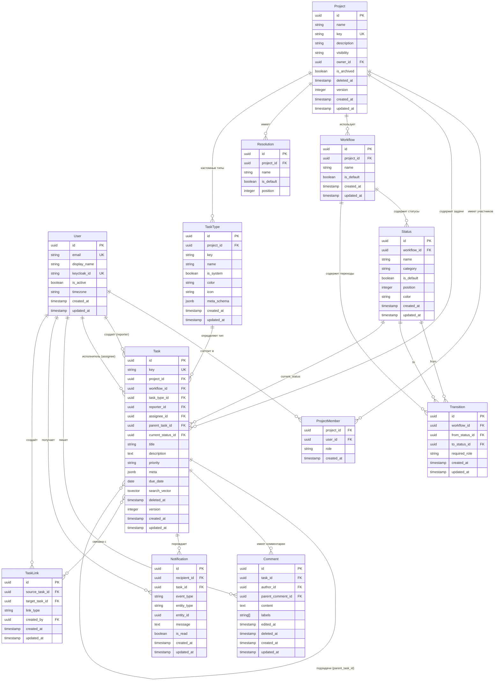

# 12. Модель данных

> **Актуальность:** отражает текущее состояние кода (ветка `main`, 2026-05-02).  
> MVP-упрощения по сравнению с целевой архитектурой зафиксированы в `docs/tech-debt.md`.

---

## ERD (Entity-Relationship Diagram)

---

## Комментарии к нетривиальным решениям

### TaskType: системные и проектные

`TaskType` — таблица, не enum. Системные типы (`is_system = true`, `project_id = NULL`): `task`, `bug`, `story`, `epic`, `decision`. Проектные типы (`project_id = <project>`) — кастомные типы конкретного проекта.

`Task.task_type_id` — FK → `task_types.id`, NOT NULL. Выбор воркфлоу при создании задачи определяется типом задачи (подробнее в разделе «FR-001»).

### Поле workflow_id у Task

`Task.workflow_id` — FK → `workflows.id`, NOT NULL. Фиксируется при создании задачи и не меняется. Даже если менеджер изменит конфигурацию воркфлоу для типа задачи — уже созданные задачи движутся по своему воркфлоу.

Текущая логика выбора при создании: берётся воркфлоу с `is_default = true` для проекта. После реализации FR-001: `ProjectTaskTypeConfig → TaskType.default_workflow_id`.

### Один исполнитель (MVP-упрощение)

`Task.assignee_id` — FK → `users.id`, nullable. В MVP — один исполнитель на задачу. Полная реализация мульти-исполнителей (таблица `Assignment` с независимыми воркфлоу) — см. `docs/tech-debt.md`.

### parent_task_id: иерархия задач

`Task.parent_task_id` — FK → `tasks.id`, nullable (self-reference). Используется для связи подзадач с родительской задачей и для связи задач с эпиком (`task_type_key = 'epic'`). ORM-relationship: `Task.subtasks`.

### StatusCategory enum

`Status.category` — enum: `initial | intermediate | final`. Семантика:
- `initial` — начальный статус; задача создаётся с `is_default = true` среди initial-статусов.
- `intermediate` — в работе.
- `final` — финальный; переход в него = завершение работы исполнителя.

Ровно один статус воркфлоу должен иметь `is_default = true` — это начальный статус для новых задач.

### Transition.required_role

`Transition.required_role` — nullable string. Если `NULL` — переход доступен всем участникам проекта. Если задано — только пользователям с соответствующей ролью в проекте (`admin`, `manager`, `member`).

Текущее ограничение MVP: одна роль на переход. Расширение до массива ролей — см. `docs/tech-debt.md`.

### Полнотекстовый поиск (search_vector)

`Task.search_vector tsvector` — объединение полей `title || description`, обновляется триггером при изменении задачи. Конфигурация: `russian` (snowball stemmer). Индекс: `GIN(search_vector)`.

Поиск по комментариям в текущей реализации не поддерживается (поле `search_vector` в `Comment` отсутствует). В v2 — добавить триггер и GIN-индекс для `Comment.content`.

### Comment.labels

`Comment.labels: string[]` — PostgreSQL ARRAY(String). Используется для внутренней классификации комментариев. Текущее значение: `["solution"]` — суррогат для MVP-реализации Decision Process (см. `docs/07-decision-process.md` раздел «MVP-упрощение»).

### Comment soft-delete

`Comment.deleted_at` — timestamp nullable. При удалении: `deleted_at` проставляется, тело комментария по-прежнему хранится (не заменяется текстом «удалён»). Физическое удаление не предусмотрено. Клиент при `deleted_at IS NOT NULL` показывает «Комментарий удалён» вместо контента.

### Политика деактивации пользователя

Физическое удаление пользователей не поддерживается. При блокировке: `User.is_active = false`. FK-ссылки остаются валидными. Деактивированный пользователь отображается в UI как «[Деактивирован]».

### Soft-delete

`Task.deleted_at` и `Project.deleted_at` — поле `timestamp nullable`. `IS NULL` — активная запись; `IS NOT NULL` — мягко удалённая; не возвращается в API-запросах. Физическое удаление — только администратором через специальный admin-эндпоинт.

### Оптимистичные блокировки

`Task.version` (integer) инкрементируется при каждом обновлении полей задачи (заголовок, описание, приоритет и т.д.). Смена `Task.current_status_id` через переход статуса — не инкрементирует `version`. При PATCH клиент передаёт текущую версию; если в БД версия выше — `409 Conflict`.

### meta (JSONB)

`Task.meta: jsonb` — произвольные метаданные задачи. В текущей реализации используется для хранения `solution_comment_id` (MVP-суррогат Decision Process).

---

## Схема воркфлоу

### Таблицы

**Workflow** — воркфлоу привязан к проекту. Один воркфлоу помечен `is_default = true`.

| Поле | Тип | Описание |
|------|-----|----------|
| id | uuid | PK |
| project_id | uuid FK | Проект (NOT NULL в текущей реализации; nullable после FR-001 — для системных воркфлоу) |
| name | string | Название («Разработка», «Баг-трекинг») |
| is_default | boolean | Используется по умолчанию для новых задач (до FR-001) |
| created_at / updated_at | timestamp | |

**Status** — статус в рамках конкретного воркфлоу.

| Поле | Тип | Описание |
|------|-----|----------|
| id | uuid | PK |
| workflow_id | uuid FK | Воркфлоу |
| name | string | Название («В работе», «Готово») |
| category | enum | `initial` / `intermediate` / `final` |
| is_default | boolean | Начальный статус — `true` ровно у одного статуса в воркфлоу |
| position | integer | Порядок отображения |
| color | string | Hex-цвет (#3B82F6) |

**Transition** — допустимый переход между статусами.

| Поле | Тип | Описание |
|------|-----|----------|
| id | uuid | PK |
| workflow_id | uuid FK | Воркфлоу |
| from_status_id | uuid FK | Исходный статус |
| to_status_id | uuid FK | Целевой статус |
| required_role | string nullable | Роль (`admin`, `manager`, `member`), которой разрешён переход. NULL = разрешено всем |

### Правила переходов

1. Пользователь может совершить переход, если существует `Transition` с `from_status_id = текущий_статус` и `to_status_id = целевой_статус`.
2. Если у перехода задан `required_role` — роль пользователя в проекте должна совпадать.
3. `admin` может совершать любые переходы независимо от `required_role`.
4. Переходы, недоступные пользователю, не отображаются в UI.

### Поведение при изменении воркфлоу

- **Переименование статуса, смена цвета, is_default** — допускается без ограничений.
- **Удаление статуса** — если в статусе есть задачи (`Task.current_status_id == status_id`), API возвращает `409 STATUS_HAS_ACTIVE_TASKS`. Клиент вызывает `POST /statuses/{id}/migrate` с `target_status_id`, после чего удаление разрешено.
- **Удаление перехода** — допускается. Если задача находится в статусе, из которого удалён переход, она теряет возможность перейти в следующий статус через UI (менеджер может сделать переход принудительно).

---

## Индексы

| Таблица | Индекс | Зачем |
|---------|--------|-------|
| `tasks` | `(project_id, deleted_at)` | Список задач проекта |
| `tasks` | `GIN(search_vector)` | Полнотекстовый поиск |
| `task_types` | `(is_system, key)` | Поиск системных типов по ключу |
| `notifications` | `(recipient_id, is_read, created_at)` | Счётчик непрочитанных |

---

## Сущности v2 (не реализованы в MVP)

Следующие таблицы описаны в продуктовых требованиях, но отсутствуют в текущем коде. Реализуются после MVP-запуска по приоритету из `docs/tech-debt.md`:

| Таблица | Зачем |
|---------|-------|
| `Assignment` | Мульти-исполнители с независимыми воркфлоу (ключевая фича) |
| `Solution` | Поданное решение исполнителя (Decision Process) |
| `TaskDecision` | Итоговое решение decision-maker'а |
| `DecisionCriteria` | Критерии оценки Solution'ов |
| `ProjectTaskTypeConfig` | Воркфлоу по типу задачи (FR-001) |
| `BoardColumn` / `BoardColumnStatus` | Независимые колонки Kanban-борды (FR-001) |
| `Label` / `TaskLabel` | Метки задач |
| `Attachment` | Вложения файлов |
| `Watcher` | Подписчики задачи |
| `TaskHistory` | История изменений |
| `AuditLog` | Аудит-лог |
| `Group` / `GroupMember` | Группы пользователей |
| `ProjectLink` | Связи между проектами |
