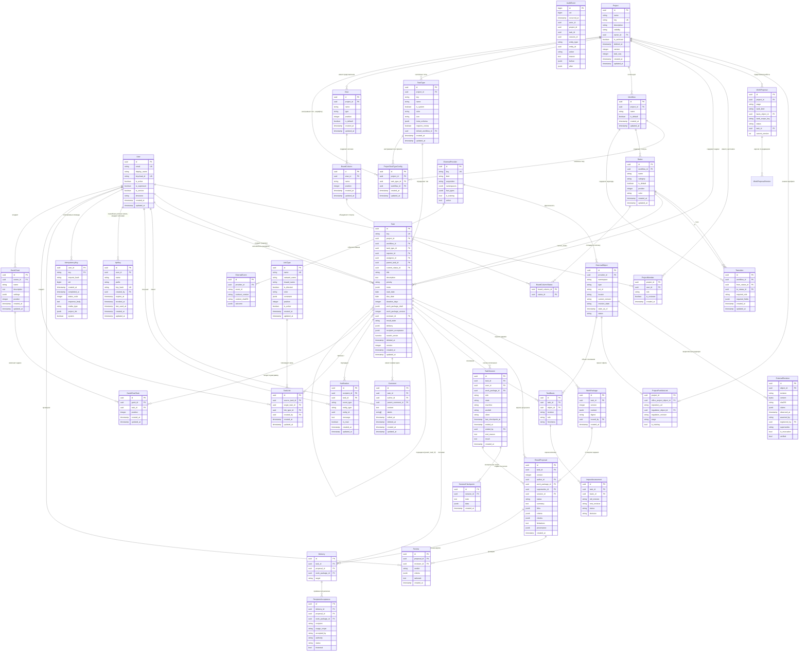

# 12. Модель данных

> **Актуальность:** отражает текущее состояние кода (ветка `main`, сверено с `backend/app/models/` 2026-07-27).  
> MVP-упрощения по сравнению с целевой архитектурой зафиксированы в `docs/tech-debt.md`.

---

## ERD (Entity-Relationship Diagram)

```mermaid
erDiagram
    User {
        uuid id PK
        string email UK
        string display_name
        string keycloak_id UK
        boolean is_active
        boolean is_superuser
        boolean is_service
        string timezone
        timestamp created_at
        timestamp updated_at
    }

    AuditEvent {
        bigint id PK
        bigint xid
        timestamp occurred_at
        uuid actor_id
        uuid project_id
        uuid task_id
        uuid session_id
        string entity_type
        uuid entity_id
        string action
        text reason
        jsonb before
        jsonb after
    }

    IdempotencyKey {
        uuid user_id PK
        string key PK
        string request_hash
        bigint xid
        timestamp created_at
        timestamp completed_at
        integer status_code
        text response_body
        string media_type
        jsonb project_ids
        boolean system
    }

    ApiKey {
        uuid id PK
        uuid user_id FK
        string name
        string prefix
        string key_hash UK
        uuid created_by FK
        timestamp expires_at
        timestamp revoked_at
        timestamp last_used_at
        timestamp created_at
        timestamp updated_at
    }

    Project {
        uuid id PK
        string name
        string key UK
        string description
        string visibility
        uuid owner_id FK
        boolean is_archived
        timestamp deleted_at
        integer version
        integer task_seq
        timestamp created_at
        timestamp updated_at
    }

    ProjectMember {
        uuid project_id FK
        uuid user_id FK
        string role
        boolean is_reviewer
        timestamp created_at
    }

    TaskType {
        uuid id PK
        uuid project_id FK
        string key
        string name
        boolean is_system
        string color
        string icon
        jsonb meta_schema
        boolean requires_review
        uuid default_workflow_id FK
        timestamp created_at
        timestamp updated_at
    }

    Workflow {
        uuid id PK
        uuid project_id FK
        string name
        boolean is_default
        timestamp created_at
        timestamp updated_at
    }

    Status {
        uuid id PK
        uuid workflow_id FK
        string name
        string category
        boolean is_default
        integer position
        string color
        timestamp created_at
        timestamp updated_at
    }

    Transition {
        uuid id PK
        uuid workflow_id FK
        uuid from_status_id FK
        uuid to_status_id FK
        string required_role
        jsonb required_fields
        timestamp created_at
        timestamp updated_at
    }

    ProjectTaskTypeConfig {
        uuid id PK
        uuid project_id FK
        uuid task_type_id FK
        uuid workflow_id FK
        timestamp created_at
        timestamp updated_at
    }

    View {
        uuid id PK
        uuid project_id FK
        string name
        string type
        integer position
        boolean is_default
        timestamp created_at
        timestamp updated_at
    }

    BoardColumn {
        uuid id PK
        uuid view_id FK
        string name
        integer position
        timestamp created_at
        timestamp updated_at
    }

    BoardColumnStatus {
        uuid board_column_id PK
        uuid status_id PK
    }

    Task {
        uuid id PK
        string key UK
        uuid project_id FK
        uuid workflow_id FK
        uuid task_type_id FK
        uuid reporter_id FK
        uuid assignee_id FK
        uuid parent_task_id FK
        uuid current_status_id FK
        string title
        text description
        string priority
        jsonb meta
        date start_date
        date due_date
        integer duration_days
        jsonb work_package_draft
        integer work_package_version
        uuid reviewer_id FK
        string result_state
        jsonb delivery
        jsonb recipient_acceptance
        tsvector search_vector
        timestamp deleted_at
        integer version
        timestamp created_at
        timestamp updated_at
    }

    WorkPackage {
        uuid id PK
        uuid task_id FK
        integer version
        jsonb content
        string digest
        uuid issued_by FK
        timestamp created_at
    }

    ResultProposal {
        uuid id PK
        uuid task_id FK
        integer version
        uuid author_id FK
        uuid work_package_id FK
        uuid supersedes_id FK
        uuid session_id FK
        string status
        text summary
        jsonb links
        jsonb criteria
        jsonb checks
        text limitations
        jsonb provenance
        timestamp created_at
    }

    Review {
        uuid id PK
        uuid proposal_id FK
        uuid reviewer_id FK
        string verdict
        jsonb criteria
        text rationale
        timestamp created_at
    }

    TaskSession {
        uuid id PK
        uuid task_id FK
        uuid user_id FK
        uuid work_package_id FK
        string role
        string state
        string machine
        string workdir
        string client
        timestamp last_checkpoint_at
        timestamp ended_at
        uuid ended_by FK
        text end_reason
        text result
        timestamp created_at
    }

    ExternalProvider {
        uuid id PK
        string key UK
        string kind
        string acquisition
        jsonb namespaces
        jsonb fact_types
        bool is_training
        bool active
    }

    ExternalObject {
        uuid id PK
        uuid provider_id FK
        string namespace
        string type
        string ext_id
        string locator
        string current_revision
        string revision_state
        timestamp state_as_of
        string status
    }

    ExternalRevision {
        uuid id PK
        uuid object_id FK
        string revision
        bytea content
        string sha256
        jsonb claims
        timestamp observed_at
        string asserted_by
        uuid registered_by FK
        string supersedes
        bool is_revocation
        bool verified
    }

    ExternalEvent {
        uuid id PK
        uuid provider_id FK
        string event_id
        string contract_version
        string content_sha256
        jsonb outcome
    }

    ProjectPortfolioLink {
        uuid project_id PK
        uuid office_project_object_id FK
        string repository_url
        uuid regulation_object_id FK
        string regulation_revision
        string stage
        bool is_training
    }

    TaskBasis {
        uuid id PK
        uuid task_id FK
        uuid object_id FK
        string revision
        string role
        string freshness
    }

    ImpactAssessment {
        uuid id PK
        uuid task_id FK
        uuid basis_id FK
        string old_revision
        string new_revision
        string status
        string decision
    }

    WorkProposal {
        uuid id PK
        uuid project_id FK
        string stage
        string work_kind
        uuid basis_object_id FK
        string work_scope_key
        string status
        uuid task_id FK
        int current_version
    }

    Delivery {
        uuid id PK
        uuid task_id FK
        uuid proposal_id FK
        uuid work_package_id FK
        string target
    }

    RecipientAcceptance {
        uuid id PK
        uuid delivery_id FK
        uuid proposal_id FK
        uuid work_package_id FK
        string recipient
        string usage_scope
        string accepted_by
        string authority
        string status
        bool historical
    }

    SessionCheckpoint {
        uuid id PK
        uuid session_id FK
        text note
        jsonb data
        timestamp created_at
    }

    TaskLink {
        uuid id PK
        uuid source_task_id FK
        uuid target_task_id FK
        uuid link_type_id FK
        uuid created_by FK
        timestamp created_at
        timestamp updated_at
    }

    LinkType {
        uuid id PK
        string name UK
        string outward_name
        string inward_name
        boolean is_directed
        string color
        jsonb constraint
        integer position
        boolean is_active
        timestamp created_at
        timestamp updated_at
    }

    Comment {
        uuid id PK
        uuid task_id FK
        uuid author_id FK
        uuid parent_comment_id FK
        text content
        string[] labels
        timestamp edited_at
        timestamp deleted_at
        timestamp created_at
        timestamp updated_at
    }

    Notification {
        uuid id PK
        uuid recipient_id FK
        uuid task_id FK
        string event_type
        string entity_type
        uuid entity_id
        text message
        boolean is_read
        timestamp created_at
        timestamp updated_at
    }

    GanttChart {
        uuid id PK
        uuid owner_id FK
        string name
        text description
        jsonb settings
        integer position
        timestamp created_at
        timestamp updated_at
    }

    GanttChartTask {
        uuid id PK
        uuid gantt_id FK
        uuid task_id FK
        integer position
        timestamp created_at
        timestamp updated_at
    }

    User ||--o{ ProjectMember : "состоит в"
    User ||--o{ Task : "создаёт (reporter)"
    User ||--o{ Task : "исполнитель (assignee)"
    User ||--o{ Comment : "пишет"
    User ||--o{ Notification : "получает"
    User ||--o{ ApiKey : "служебная учётная запись владеет ключами"
    User ||--o{ IdempotencyKey : "повторяемые команды"
    Task ||--o{ WorkPackage : "версии задания"
    Task ||--o{ ResultProposal : "версии результата"
    ResultProposal ||--o{ Review : "проверки"
    WorkPackage ||--o{ ResultProposal : "по версии задания"
    Task ||--o{ TaskSession : "сессии исполнения"
    TaskSession ||--o{ SessionCheckpoint : "контрольные точки"
    TaskSession ||--o{ ResultProposal : "подано из сессии"
    ExternalProvider ||--o{ ExternalObject : "идентичность"
    ExternalObject ||--o{ ExternalRevision : "закреплённые редакции"
    ExternalProvider ||--o{ ExternalEvent : "события обмена"
    Project ||--o| ProjectPortfolioLink : "режим портфеля"
    ExternalObject ||--o| ProjectPortfolioLink : "проект офиса"
    Task ||--o{ TaskBasis : "основания"
    ExternalObject ||--o{ TaskBasis : "объект основания"
    TaskBasis ||--o{ ImpactAssessment : "оценка влияния"
    Project ||--o{ WorkProposal : "предложения работы"
    WorkProposal ||--o{ WorkProposalVersion : "версии по редакциям"
    Task ||--o{ Delivery : "поставки"
    ResultProposal ||--o{ Delivery : "точная версия"
    Delivery ||--o{ RecipientAcceptance : "приёмка получателем"
    User ||--o{ Review : "проверяет"
    User ||--o{ TaskLink : "создаёт"
    User ||--o{ GanttChart : "владеет"

    Project ||--o{ ProjectMember : "имеет участников"
    Project ||--o{ Task : "содержит задачи"
    Project ||--o{ Workflow : "использует"
    Project ||--o{ TaskType : "кастомные типы"
    Project ||--o{ View : "имеет представления"
    Project ||--o{ ProjectTaskTypeConfig : "настраивает тип→воркфлоу"

    TaskType ||--o{ Task : "определяет тип"
    TaskType ||--o{ ProjectTaskTypeConfig : "настраивается в проекте"
    Workflow ||--o{ ProjectTaskTypeConfig : "назначен типу"

    Workflow ||--o{ Status : "содержит статусы"
    Workflow ||--o{ Transition : "содержит переходы"
    Status ||--o{ Transition : "from"
    Status ||--o{ Transition : "to"
    Status ||--o{ Task : "current_status"

    View ||--o{ BoardColumn : "содержит колонки"
    BoardColumn ||--o{ BoardColumnStatus : "объединяет статусы"
    Status ||--o{ BoardColumnStatus : "попадает в колонку"

    Task ||--o{ Task : "подзадачи (parent_task_id)"
    Task ||--o{ Comment : "имеет комментарии"
    Task ||--o{ Notification : "порождает"
    Task }o--o{ TaskLink : "связана с"
    LinkType ||--o{ TaskLink : "типизирует связь"

    GanttChart ||--o{ GanttChartTask : "включает задачи"
    Task ||--o{ GanttChartTask : "входит в диаграмму"
```

---

## Комментарии к нетривиальным решениям

### TaskType: системные и проектные

`TaskType` — таблица, не enum. Системные типы (`is_system = true`, `project_id = NULL`): `task`, `bug`, `story`, `epic`, `decision`. Проектные типы (`project_id = <project>`) — кастомные типы конкретного проекта.

`Task.task_type_id` — FK → `task_types.id`, NOT NULL. Выбор воркфлоу при создании задачи определяется типом задачи (подробнее в разделе «FR-001»).

### Поле workflow_id у Task

`Task.workflow_id` — FK → `workflows.id`, NOT NULL. Фиксируется при создании задачи и не меняется. Даже если менеджер изменит конфигурацию воркфлоу для типа задачи — уже созданные задачи движутся по своему воркфлоу.

Логика выбора при создании (FR-001 реализован, `workflow_service.get_workflow_for_task_type`): если клиент передал `workflow_id` — берётся он; иначе `ProjectTaskTypeConfig(project_id, task_type_id)` → если конфига нет, fallback на воркфлоу проекта с `is_default = true`; если и его нет — `400 NO_DEFAULT_WORKFLOW`. Системные воркфлоу (`project_id = NULL`) подхватываются только через явный `ProjectTaskTypeConfig`.

Валидации «выбранный `workflow_id` совместим с `task_type`» нет — см. `docs/tech-debt.md`.

### Один исполнитель (MVP-упрощение)

`Task.assignee_id` — FK → `users.id`, nullable. Один исполнитель на задачу — окончательно ([ADR-016](./decisions/ADR-016-responsible-review-model.md)); таблица `Assignment` не восстанавливается.

### parent_task_id: иерархия задач

`Task.parent_task_id` — FK → `tasks.id`, nullable (self-reference). Используется для связи подзадач с родительской задачей и для связи задач с эпиком (`task_type_key = 'epic'`). ORM-relationship: `Task.subtasks`.

### Resolution удалён из модели

Таблицы `resolutions` в коде нет. Модель, схемы, сервис и 4 CRUD-эндпоинта удалены в `8b7f59f` (2026-05-06, [ADR-015](./decisions/ADR-015-resolution-removal.md)) как преждевременная мера; переход в финальный статус больше не требует `resolution_id`, ошибки `RESOLUTION_REQUIRED` не существует. Исторические упоминания резолюций в `09-mvp.md`, `stories/core.md`, ADR-006 и архитектурных ревью относятся к состоянию до этого коммита.

### View и BoardColumn: слой отображения (FR-001)

`View` — именованное представление проекта (`kanban` / `backlog` / `epic_tree`). Kanban-представление содержит `BoardColumn`, каждая колонка через таблицу связи `BoardColumnStatus` объединяет один или несколько статусов. Колонки живут независимо от воркфлоу: один статус может попадать в колонки разных представлений (уникальность `status_id` намеренно снята), а задачи разных воркфлоу — сходиться в одну колонку. Обоснование — [ADR-009](./decisions/ADR-009-board-columns-fr001.md).

### StatusCategory enum

`Status.category` — enum: `initial | intermediate | final`. Семантика:
- `initial` — начальный статус; задача создаётся с `is_default = true` среди initial-статусов.
- `intermediate` — в работе.
- `final` — финальный; переход в него = завершение работы исполнителя. Резолюция при этом не запрашивается.

Ровно один статус воркфлоу должен иметь `is_default = true` — это начальный статус для новых задач.

### Transition.required_role

`Transition.required_role` — nullable string. Если `NULL` — переход доступен всем, кто может переводить задачу (исполнитель или `manager`/`admin`). Если задано — значение трактуется как **минимальная** роль в проекте по порядку `viewer` < `member` < `manager` < `admin`; неизвестное значение — отказ (`TRANSITION_ROLE_REQUIRED`). Проверка реализована в FR-003 (TT-01).

Текущее ограничение MVP: одна роль на переход. Расширение до массива ролей — см. `docs/tech-debt.md`.

### Полнотекстовый поиск (search_vector)

`Task.search_vector tsvector` — объединение полей `title || description`, обновляется триггером при изменении задачи. Конфигурация: `russian` (snowball stemmer). Индекс: `GIN(search_vector)`.

Поиск по комментариям в текущей реализации не поддерживается (поле `search_vector` в `Comment` отсутствует). В v2 — добавить триггер и GIN-индекс для `Comment.content`.

### Comment.labels

`Comment.labels: string[]` — PostgreSQL ARRAY(String). Используется для внутренней классификации комментариев. Метки — свободная классификация; метка `solution` больше ничего не значит (результат задачи — `ResultProposal`, ADR-021).

### Comment soft-delete

`Comment.deleted_at` — timestamp nullable. При удалении: `deleted_at` проставляется, тело комментария по-прежнему хранится (не заменяется текстом «удалён»). Физическое удаление не предусмотрено. Клиент при `deleted_at IS NOT NULL` показывает «Комментарий удалён» вместо контента.

### Политика деактивации пользователя

Физическое удаление пользователей не поддерживается. При блокировке: `User.is_active = false`. FK-ссылки остаются валидными. Деактивированный пользователь отображается в UI как «[Деактивирован]».

### Soft-delete

`Task.deleted_at` и `Project.deleted_at` — поле `timestamp nullable`. `IS NULL` — активная запись; `IS NOT NULL` — мягко удалённая; не возвращается в API-запросах. Физическое удаление — только администратором через специальный admin-эндпоинт.

### Оптимистичные блокировки

`Task.version` (integer) инкрементируется при каждом обновлении полей задачи и при переходе статуса. PATCH и переход берут строку задачи под `SELECT … FOR UPDATE` и сравнивают версию уже под блокировкой, поэтому из двух запросов с одной исходной версией проходит ровно один, второй получает `409 VERSION_CONFLICT` с `current_version` (FR-003, TT-02). В переходе `version` необязателен: если передан — проверяется.

### Служебные учётные записи и ApiKey

`User.is_service = true` — учётная запись агента или интеграции ([ADR-017](./decisions/ADR-017-service-accounts-api-keys.md)): `keycloak_id = "service:<uuid>"`, входа через Keycloak нет. Аутентифицируется ключом `ApiKey`: хранится SHA-256 токена (`key_hash`, уникален) и первые 10 символов (`prefix`) для опознания. Ключ недействителен при `revoked_at`, истёкшем `expires_at` или неактивной учётной записи; проверка по БД на каждом запросе. `ON DELETE CASCADE` от пользователя.

### AuditEvent: журнал событий

Append-only таблица значимых изменений ([ADR-018](./decisions/ADR-018-audit-log-event-journal.md)), пишется в транзакции изменения. Внешних ключей нет намеренно — запись переживает строки, которые описывает (поэтому `AuditEvent` не связан с другими сущностями на диаграмме). `xid` — id транзакции-писателя (`pg_current_xact_id()`), вместе с `id` образует курсор чтения; отдаются события только завершённых транзакций (`xid < pg_snapshot_xmin`). Индексы `(project_id, xid, id)` и `(task_id, xid, id)`.

### IdempotencyKey: повтор команд

Строка на пару (пользователь, ключ) ([ADR-019](./decisions/ADR-019-idempotency-keys.md)). Вставляется в транзакции команды до её выполнения, поэтому существует только если команда зафиксирована. `completed_at`, `status_code`, `response_body` заполняются сразу после ответа. `xid` связывает ключ с событиями аудита той же транзакции; по ним заполняются `project_ids`/`system` для повторной проверки прав. Срок действия — 24 часа.

### Задание, результат, проверка, сессии (FR-003)

- **WorkPackage** — неизменяемая версия задания ([ADR-020](./decisions/ADR-020-work-package.md)); черновик — `Task.work_package_draft`, текущая версия — `Task.work_package_version`. `digest` — SHA-256 канонического JSON `content`; критерии имеют ключи `c1`, `c2`…
- **ResultProposal** — результат исполнителя ([ADR-021](./decisions/ADR-021-result-proposal-review.md)), неизменяем; `(task_id, version)` уникально; статус `submitted` / `accepted` / `changes_requested` / `rejected` / `withdrawn` / `superseded` / `historical` (перенесённые `solution`-комментарии).
- **Review** — неизменяемая проверка одной версии с обязательным `rationale`.
- `Task.result_state` вычисляется из предложений и хранится для фильтров; `Task.reviewer_id` — назначенный проверяющий; `Task.delivery` / `Task.recipient_acceptance` — сводка текущей поставки и её приёмки; записи — `Delivery` / `RecipientAcceptance` (ADR-024).
- `ProjectMember.is_reviewer` — профиль проверяющего; `TaskType.requires_review` — финальный статус только после вердикта; `Transition.required_fields` — обязательные поля `meta` ([ADR-023](./decisions/ADR-023-process-types.md)).
- **TaskSession** ([ADR-022](./decisions/ADR-022-task-sessions.md)) — частичный уникальный индекс `uq_task_sessions_active_executor (task_id) WHERE state='active' AND role='executor'`; завершается только явно. `AuditEvent.session_id` — сессия, в которой сделано изменение.

### Внешние системы и режим портфеля (ADR-024)

Контракт с офисом и системой требований v1.0 ([ADR-024](./decisions/ADR-024-external-contract-v1.md)).

- **ExternalProvider** — реестр поставщиков; `key` постоянен (адрес не входит в идентичность), `namespaces` — где поставщик может говорить, `fact_types` — виды, по которым он уполномочен. `is_training` — учебный, неизменен.
- **ExternalObject** — идентичность `(provider_id, namespace, type, ext_id)` уникальна. `current_revision` / `revision_state` (`unknown`, `unconfirmed`, `current`, `pending_reconciliation`) / `state_as_of`; `status` `active`/`revoked`. **ExternalIdentityAlias** — прежняя идентичность → объект, с причиной.
- **ExternalRevision** — `(object_id, revision)` уникально; `content` — точные байты, `sha256` — их хеш (NULL для ссылки, известной только из снимка); `claims` — разобранные утверждения; `verified = false` — непроверенное сообщение; `supersedes`/`superseded_by` — явное замещение.
- **ExternalEvent** — `(provider_id, event_id)` уникально, `content_sha256` — хеш тела команды, `outcome` — итог для повтора. **ExternalSnapshot** — область, полнота, `as_of`, непрозрачный `cursor`, итог.
- **ProjectPortfolioLink** — одна на проект, `office_project_object_id` уникален в установке; нет строки — самостоятельный проект.
- **TaskBasis** — `(task_id, object_id, role)` уникально; роли `cause`/`input`/`normative`/`reference`/`grant`; `freshness` `pinned`/`confirm_current`. Выпуск WorkPackage копирует основания в `content.bases`.
- **TaskBlocker**, **ImpactAssessment** — условие 5 готовности; решение оценки — `continue`/`reissue`/`recheck`/`stop`.
- **WorkProposal** — ключ `(project_id, stage, work_kind, basis_object_id, work_scope_key)` уникален; **WorkProposalVersion** — `(proposal_id, basis_revision)` уникально.
- **Delivery** — точная принятая версия `ResultProposal` и её `WorkPackage`; **RecipientAcceptance** — привязка к поставке, получатель, область использования, автор, полномочие, `status` `accepted`/`withdrawn`; `historical = true` — ручная запись до ADR-024 без привязки. `Task.delivery` / `Task.recipient_acceptance` остаются сводкой текущей поставки (с `delivery_id` / `acceptance_id`).

### Нумерация задач (Project.task_seq)

`Project.task_seq` — последний выданный номер задачи в проекте. `create_task` увеличивает его одним `UPDATE … RETURNING`; блокировка строки проекта сериализует параллельное создание, ключ `{project.key}-{task_seq}` не повторяется (FR-003, TT-03). Номера удалённых задач не переиспользуются. Постоянный идентификатор задачи — UUID; ключ проекта не меняется после создания.

### meta (JSONB)

`Task.meta: jsonb` — произвольные метаданные задачи. Проверяется по `TaskType.meta_schema`, если схема задана (ADR-023); ключи `meta` могут быть обязательными для переходов (`Transition.required_fields`).

---

## Схема воркфлоу

### Таблицы

**Workflow** — воркфлоу привязан к проекту. Один воркфлоу помечен `is_default = true`.

| Поле | Тип | Описание |
|------|-----|----------|
| id | uuid | PK |
| project_id | uuid FK nullable | Проект. `NULL` — системный воркфлоу, доступный всем проектам через `ProjectTaskTypeConfig` (FR-001) |
| name | string | Название («Разработка», «Баг-трекинг») |
| is_default | boolean | Fallback-воркфлоу проекта, когда для типа задачи нет `ProjectTaskTypeConfig` |
| created_at / updated_at | timestamp | |

**Status** — статус в рамках конкретного воркфлоу.

| Поле | Тип | Описание |
|------|-----|----------|
| id | uuid | PK |
| workflow_id | uuid FK | Воркфлоу |
| name | string | Название («В работе», «Готово») |
| category | enum | `initial` / `intermediate` / `final` |
| is_default | boolean | Начальный статус — `true` ровно у одного статуса в воркфлоу |
| position | integer | Порядок отображения |
| color | string | Hex-цвет (#3B82F6) |

**Transition** — допустимый переход между статусами.

| Поле | Тип | Описание |
|------|-----|----------|
| id | uuid | PK |
| workflow_id | uuid FK | Воркфлоу |
| from_status_id | uuid FK | Исходный статус |
| to_status_id | uuid FK | Целевой статус |
| required_role | string nullable | Роль (`admin`, `manager`, `member`), которой разрешён переход. NULL = разрешено всем |

### Правила переходов

1. Пользователь может совершить переход, если существует `Transition` с `from_status_id = текущий_статус` и `to_status_id = целевой_статус`.
2. Если у перехода задан `required_role` — роль пользователя в проекте должна совпадать.
3. `admin` может совершать любые переходы независимо от `required_role`.
4. Переходы, недоступные пользователю, не отображаются в UI.

### Поведение при изменении воркфлоу

- **Переименование статуса, смена цвета, is_default** — допускается без ограничений.
- **Удаление статуса** — если в статусе есть задачи (`Task.current_status_id == status_id`), API возвращает `409 STATUS_HAS_ACTIVE_TASKS`. Клиент вызывает `POST /statuses/{id}/migrate` с `target_status_id`, после чего удаление разрешено.
- **Удаление перехода** — допускается. Если задача находится в статусе, из которого удалён переход, она теряет возможность перейти в следующий статус через UI (менеджер может сделать переход принудительно).

---

## Индексы

Фактически объявленные в моделях и миграции:

| Таблица | Индекс / ограничение | Зачем |
|---------|----------------------|-------|
| `tasks` | `GIN(search_vector)` — `ix_tasks_search_vector` | Полнотекстовый поиск (создаётся сырым DDL вместе с триггером) |
| `notifications` | `(recipient_id, is_read, created_at)` — `ix_notifications_recipient_unread` | Счётчик непрочитанных |
| `views` | `(project_id, position)` — `ix_views_project_position` | Список представлений проекта по порядку |
| `board_columns` | `(view_id, position)` — `ix_board_columns_view_position` | Колонки борды по порядку |
| `project_task_type_configs` | `UNIQUE (project_id, task_type_id)` | Один воркфлоу на тип задачи в проекте |
| `users` / `projects` / `tasks` / `link_types` | `UNIQUE` на `email`, `keycloak_id`, `key`, `name` | Естественные ключи |

Индексов на `tasks(project_id, deleted_at)` и `task_types(is_system, key)` нет — PostgreSQL не создаёт индексы под FK автоматически. Добавить при появлении заметных объёмов.

---

## Сущности v2 (не реализованы в MVP)

Следующие таблицы описаны в продуктовых требованиях, но отсутствуют в текущем коде. `Assignment`, `Solution`, `TaskDecision`, `DecisionCriteria` из этого списка убраны — отменены [ADR-016](./decisions/ADR-016-responsible-review-model.md). Реализуются после MVP-запуска по приоритету из `docs/tech-debt.md`:

| Таблица | Зачем |
|---------|-------|
| `Label` / `TaskLabel` | Метки задач |
| `Attachment` | Вложения файлов |
| `Watcher` | Подписчики задачи |
| `TaskHistory` | История изменений |
| `AuditLog` | Аудит-лог |
| `Group` / `GroupMember` | Группы пользователей |
| `ProjectLink` | Связи между проектами |
