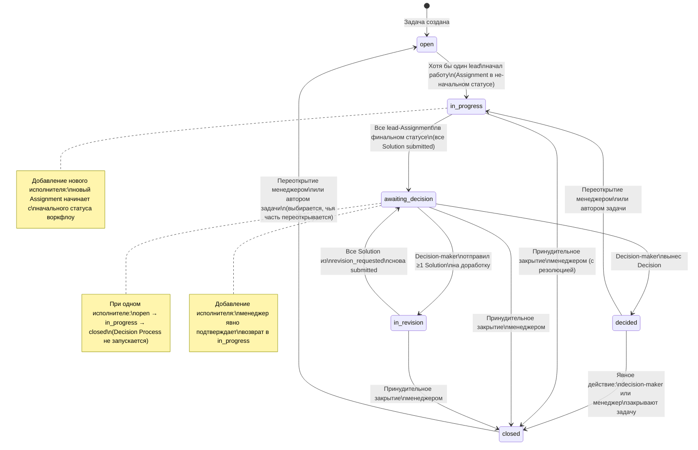
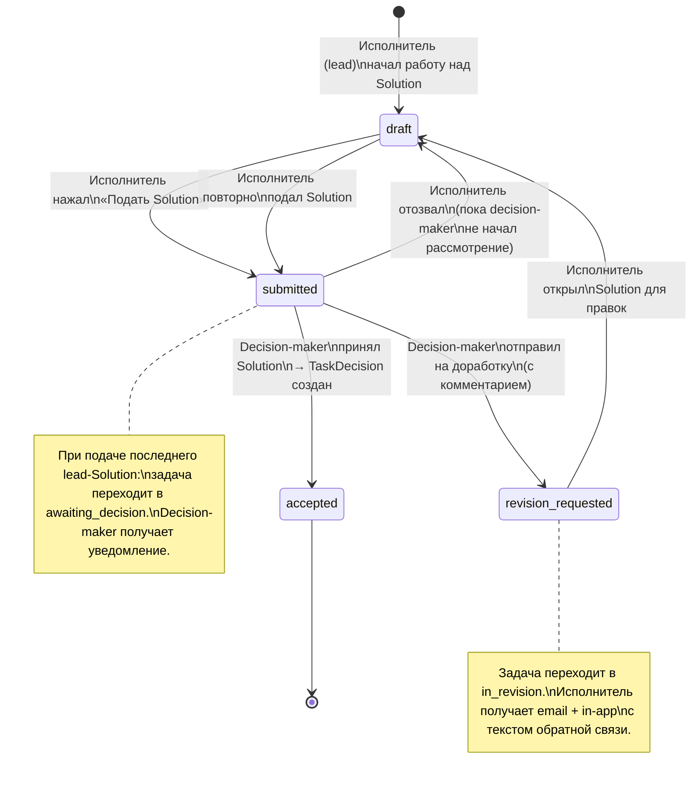
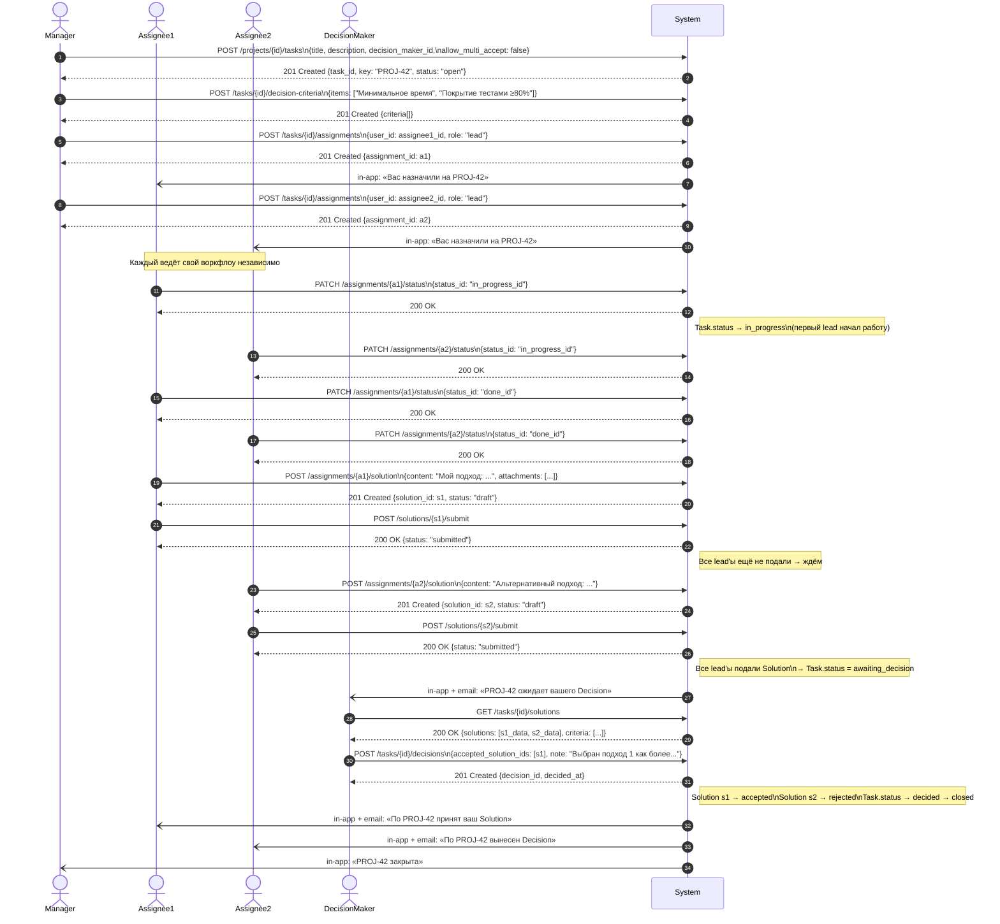

# 14. Диаграммы и схемы

---

## 3.1. State-диаграммы

### Глобальные состояния задачи

Эта диаграмма показывает все состояния задачи с учётом мульти-исполнителей, включая граничные случаи.

### Состояния Solution

### Граничные случаи (описание)

| Сценарий | Поведение |
|----------|-----------|
| Добавление исполнителя в задачу со статусом `open` | Новый Assignment создаётся с начальным статусом воркфлоу. Задача остаётся в `open`. |
| Добавление исполнителя в задачу со статусом `in_progress` | Новый Assignment создаётся с начальным статусом. Задача остаётся в `in_progress`. |
| Добавление исполнителя в задачу со статусом `awaiting_decision` | Менеджер подтверждает возврат задачи в `in_progress`. Новый Assignment стартует с начального статуса. |
| Добавление исполнителя в `decided` / `closed` | Недоступно без явного переоткрытия задачи. |
| Отзыв последнего поданного Solution | Задача возвращается из `awaiting_decision` в `in_progress`. |
| Принудительное закрытие менеджером | Все незавершённые Assignment получают статус «Закрыто менеджером». Задача → `closed`. |
| Удаление lead-исполнителя с `submitted` Solution | Solution становится недействительным. Если оставшиеся lead'ы уже подали — задача остаётся/возвращается в `awaiting_decision`. Иначе — в `in_progress`. |
| Один исполнитель | `open → in_progress → closed`. Decision Process не запускается. |

---

## 3.2. Sequence-диаграмма: Сценарий S2 — Decision Process

Акторы: Manager (менеджер), Assignee1 (lead-исполнитель 1), Assignee2 (lead-исполнитель 2), DecisionMaker (decision-maker), System (бэкенд + уведомления).

---

## 3.3. Таблица уведомлений

Легенда каналов: **in-app** — уведомление в интерфейсе приложения; **email** — письмо на email.

По умолчанию все участники задачи (исполнители + автор) автоматически становятся Watcher'ами при назначении/создании. Уведомления получают Watcher'ы задачи (если не отписались) + специфичные получатели события.

| # | Событие | Получатели | Канал |
|---|---------|-----------|-------|
| 1 | Задача создана | Автор задачи (Reporter) | in-app |
| 2 | Пользователь назначен исполнителем (Assignment создан) | Новый исполнитель | in-app |
| 3 | Исполнитель удалён из задачи | Удалённый исполнитель | in-app |
| 4 | Статус задачи (глобальный) изменён | Все Watcher'ы | in-app |
| 5 | Добавлен комментарий | Все Watcher'ы | in-app |
| 6 | Пользователь упомянут через @ | Упомянутый пользователь | in-app |
| 7 | Задача переходит в `awaiting_decision` | Decision-maker | in-app + email |
| 8 | Solution отправлен на доработку (revision_requested) | Исполнитель, чей Solution отправлен | in-app + email |
| 9 | Decision вынесен | Lead-исполнители — email + in-app; прочие Watcher'ы — только in-app | in-app + email (только lead'ы); in-app (прочие Watcher'ы) |
| 10 | Задача переоткрыта | Все Watcher'ы | in-app |
| 11 | Задача принудительно закрыта менеджером | Все исполнители с незавершёнными Assignment | in-app |
| 12 | Вложение добавлено к задаче | Все Watcher'ы | in-app |
| 13 | Due date наступает завтра | Все lead-исполнители | in-app |
| 14 | Роль исполнителя в задаче изменена | Исполнитель, чья роль изменена | in-app |
| 15 | Новый исполнитель добавлен в задачу в `awaiting_decision` (задача возвращается в in_progress) | Decision-maker; все lead-исполнители | in-app |
| 16 | Статус задачи/Assignment сброшен из-за изменения воркфлоу | Все участники затронутых задач (исполнители, автор, decision-maker) | in-app |

### Правила подписки (auto-watchers)

- **Автор задачи (Reporter)** — автоматически Watcher при создании задачи.
- **Исполнитель (Assignment)** — автоматически Watcher при назначении; отписка не удаляет Assignment.
- **Decision-maker** — автоматически Watcher при создании задачи.
- **reviewer и consultant** — автоматически Watcher при назначении.
- **Любой пользователь** — может подписаться вручную через кнопку «Следить».

### Управление уведомлениями

- Каждый пользователь может отключить отдельные типы событий в настройках уведомлений.
- Отписка от задачи (Watcher) прекращает уведомления по задаче, но не снимает Assignment.
- Email для Decision Process (события 7, 8, 9) можно отключить отдельным переключателем.
